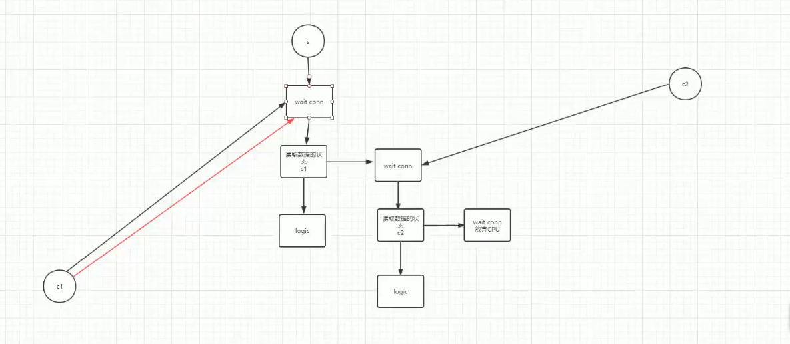

## NIO

no-blocking io 非阻塞io

#### BIO

**阻塞**

- accept() 等待连接
- read()   读取信息

**缺点**

-   在不考虑多线程的情况下,bio无法处理并发
    -   **原因:**阻塞让bio放弃了线程资源,无法处理并发
    -   **处理:**使用线程处理,将阻塞处理放入线程
    -   **线程弊端:**
        -   占用cpu,浪费线程
        -   不活跃线程较多,使用单线程

####NIO

