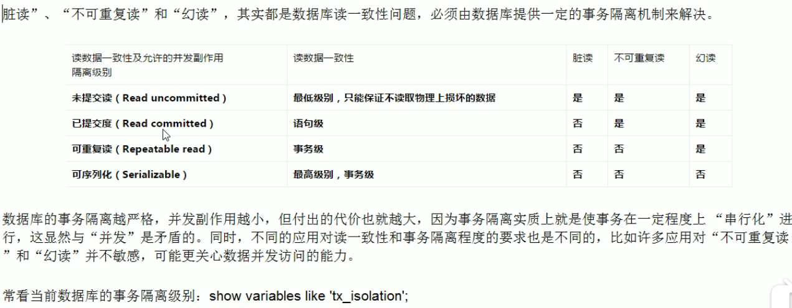
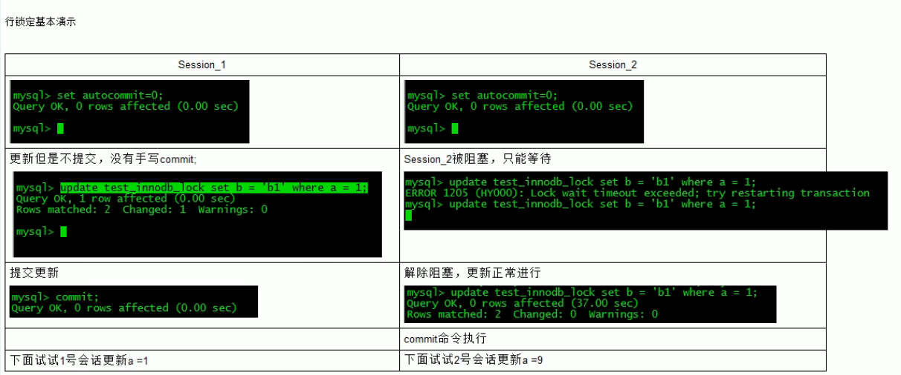

## mysql锁机制

#### 行锁

读锁：共享。
&emsp;当前锁表session,可以读自己，不能写，不能读别人。需要解锁后才能操作.
&emsp;其它session,可以读当前和别的表，可以修改别的表。不可以修改已锁表需要等待锁表session解锁。写入堵塞。

写锁：排它。
&emsp;当前session能读写表。不能查看修改别的表。
&emsp;其它session读写锁表阻塞。

**读锁堵塞写，不堵塞读。写锁阻塞读写。**


表锁：基于myisam引擎
``` sql
加锁：
lock table tableName1 read(write),tableName2 read(writer),other;
查看加过的锁
show open tables
释放锁：
unlock tables;
```


##### 表锁分析


#### 行锁
引擎innodb。开销大，加锁慢，会出现死锁。锁定粒度最小，发送锁冲突该概率最小，并发度最高。
innodb：支持事务，采用行级锁。

##### 事务特性ACID
- 原子性（Atomicity）
  -  事务是一个原子操作单元，对其数据的修改，要么全部都执行，要么全部不执行。
-  一致性（Consistent） 
   -  事务开始和完成是，数据都必须保持一致状态。
   -  这意味着所有相关的数据规则都必须应用于事务的修改，以保持数据完整性
   -  事务结束时，所有内部数据结构（如b树索引或双向链表）也必须是正确
-  隔离性（Isolation）
   -  数据库提供一定的隔离机制
   -  保证事务在不受外部并发操作影响的“独立”环境执行。
   -  这意味着事务处理过程中，中间状态对外部是不可见的。反之亦然
-  持久性（Durable）
   -  事务完成后，它对数据的修改是永久性的，即使出现系统故障也能保持

##### 并发事务带来的问题
- 更新丢失（lost update）
- 脏读（dirty reads）
  - 事务A读到事务B，已修改但尚未提交的数据，还在此数据基础上做了操作。当事务B回滚，事务A数据无效。不符合一致性要求
  - 修改数据
- 不可重复读（non-repeatable reads）
  - 事务A读到了事务B已提交的修改数据。不符合隔离性
- 幻读（phantom reads）
  - 事务A读取到事务B提交的重复数据。不符合隔离性。
  - 新增数据
  
##### 事务隔离级别


##### 行锁基本演示


**行锁变表锁**
- 索引失效行锁变表锁
  - varchar类型少了单引号

**间隙锁**


**行加锁**
``` sql
begin
    -- 锁定一个行后，其它操作会被阻塞，直到commit后
    select  * from test where id=1 from update;
commit;
```
##### 行锁分析
```sql
    show status like 'innodb_row_lock%';
```


**优化建议**
&emsp; 1.尽量让素有数据检索都通过索引来完成，**避免无索引行锁变表锁**
&emsp; 2.合理设计索引，尽量缩短索引范围
&emsp; 3.尽可能较少检索条件
&emsp; 4.尽量控制事务大小，减少锁定资源量和时间长度
&emsp; 5.尽可能低级别事务隔离