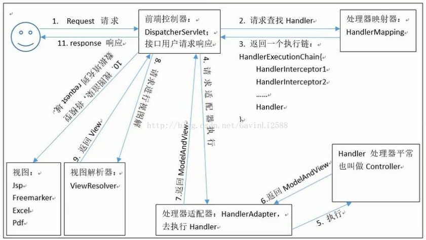
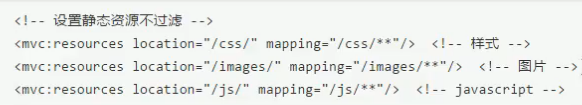

## spring MVc

表现层架构
基于组件方式执行流程

#### 架构角色
- 前端控制器(DistpatcherServlet)
  -  核心组件。调用其它组件处理用户请求
- 请求到处理器映射(handleMapping)
  -  找到处理器 
- 处理适配器（HandlerAdapter）
  -  通过适配器相应的处理器，并执行
- 视图解析器（ViewResolver）
  - 找到页面，生成视图
- 处理器或页面控制器（Controller）
  -  处理业务逻辑
-  视图 （View）
   -  页面
- 验证器（Validator）
- 命令对象（Command）
- 表单对象（FormObject）

**执行流程**


#### 请求
**请求参数**
java对象参数：
- form表单提交，自动对应bean对象的属性相同的请求参数
- 引用类型。请求参数：引用对象.引用对象属性
- 集合。
  - list：list[0]
  - map:map['key']
``` html
 <form action="/person/form" method="post">
        <input type="text" name="name"/>
        <input type="text" name="age"/>
        <%-- 引用对象 指定引用对象属性--%>
        <input type="text" name="user.name"/>
        <%-- list集合 指定索引 --%>
        <input type="text" name="list[0].uname">
        <%-- map集合 指定key --%>
        <input type="text" name="map['username'].uname">
        <input type="submit" value="submit">
    </form>
```
**参数列表注解**
- RequestParam
  - 指定参数
- RequestBody
  - 获取请求体内容
  - 直接得到key=value&key=value...结构数据
  - get请求不适用。get没有请求体。
  - 应用：ajax请求
- PathVariable
  - 用于绑定url中的占位符
  - RequestMapping("/person/{id}").{id}→占位符
  - 该注解获取占位符的值
- RequestHeader
  - 获取指定请求头的值  
  - value：请求头中的字段
- CookieValue
  - 获取指定cookie名称的值
  - value：cookie名称。 request：是否必须
- ModelAttribute
  - 方法上使用：
     - 先执行被注解方法，在执行需要被调用的controller方法
    - 表示当前方法，会在控制器的方法执行之前，先执行
    - 可以修改时没有返回值的方法， 也可以修饰具体返回值的方法
    - 应用场景
      - 在处理真正的controller方法前，处理被注解方法
  - 作用在参数列表上
    - 获取指定的数据给参数复制
- SessionAttribute
  - 用于多次执行控制器方法间的参数共享
    - value：属性名
    - type：存入数据类型


**过滤器**
- 中文乱码
``` xml
<!-- web.xml -->
<filter>
    <filter-name>encodingFilter</filter-name>
    <filter-class>org.springframework.web.filter.CharacterEncodingFilter</filter-class>
    <init-param>
        <param-name>encoding</param-name>
        <param-value>utf-8</param-value>
    </init-param>
</filter>
<filter-mapping>
    <filter-name>encodingFilter</filter-name>
    <url-pattern>/*</url-pattern>
</filter-mapping>
```

**自定义类型转换器**
1.实现spring自带的转换接口
```java
/*字符串转日期*/
public class StringToDateConverter implements Converter<String , Date> {
    @Override
    public Date convert(String s) {
        if(s==null){
            throw new RuntimeException("传入转换参数数据为空");
        }
        DateFormat df=new SimpleDateFormat("yyyy-MM-dd");
        try {
            return  df.parse(s);
        } catch (ParseException e) {
            e.printStackTrace();
            throw new RuntimeException("转换失败");
        }
    }
```
2.在xml文件中注册实现类
```xml
<!-- springmvc.xml -->
<bean id="conversionService" class="org.springframework.context.support.ConversionServiceFactoryBean">
    <property name="converters">
        <set>
            <bean class="com.montreal.utils.StringToDateConverter"></bean>
        </set>
    </property>
</bean>
```
3.注解生效
```xml
  <!-- springmvc.xml -->
  <mvc:annotation-driven conversion-service="conversionService"/>
```

#### 响应

**响应类型**
- String
  - 跳转页面。视图地址
- void 
  - RequestMapping("/person/void")
  - 默认跳转该请求方法的地址(person/void)
  - 自定义跳转地址
    - request.getRequestDispatcher("/WEB-INF/pages/").forward(request,response);
  - 重定向
    -  response.sendRedirect(request.getContextPath()+"/index.jsp");
   -  直接响应
      -  response.getWriter.print("xxxx");
- ModelAndView
  - 跳转页面、附带数据
- 关键字
  - 跳转
    - return "forward:/WEB-INF/hello.jsp";
  - 重定向
    - return "redirect:/index.jsp";
  
**响应json**  
静态资源放行拦截

- ResponseBody
 ```java
  public @ResponseBody User getUser()   {
       User user = new User();
       return user;
  }
  ```

  #### 文件上传
  **文件前提**
  


#### 异常处理器

1.创建异常类
```java
public class SysException extends Exception{

    private String message;


    public SysException(String message) {
        this.message = message;
    }

    @Override
    public String getMessage() {
        return message;
    }

    public void setMessage(String message) {
        this.message = message;
    }
}
```
2.实现springmvc异常处理接口
```java
public class SysExceptionResolver implements HandlerExceptionResolver {

    SysException sysException=null;

    @Override
    public ModelAndView resolveException(HttpServletRequest httpServletRequest, HttpServletResponse httpServletResponse,
            Object o, Exception e) {
        if(e instanceof SysException){
            sysException=(SysException)e;
        }else {
            e=new SysException("系统正在维护");
        }
        ModelAndView modelAndView=new ModelAndView();
        modelAndView.addObject("errorMsg",e.getMessage());
        modelAndView.setViewName("error.jsp");

        return modelAndView;
    }
}
```
3.通过bean工厂注册异常处理器
```xml
 <bean id="exceptionResolver" class="com.montreal.exception.SysExceptionResolver"></bean>
```
4.使用
```java
//controller
@RequestMapping("/testError")
public String TestError() throws Exception{
    try {
        int i=10/0;
    } catch (Exception e) {
        e.printStackTrace();
        System.out.println(e.getMessage());
        throw new SysException("页面错误");
    }
    return "index.jsp";
}
```
``` html
<!-- jsp  -->
<%@ page contentType="text/html;charset=UTF-8" language="java" isELIgnored="false" %>
<html>
<head>
    <title>error</title>
</head>
<body>
  <h1>  ${errorMsg}</h1>
</body>
</html>
```
#### 拦截器
**过滤器和拦截器**
- 过滤器是servlet规范中的一部分。任何javaweb工程都能使用
- 拦截器只能在springmvc架构中使用
- 过滤器在url-pattern中配置/*之后，**对所有要访问的资源进行拦截**
- 拦截器**只会拦截控制方法**。如果访问静态资源、js则不会被拦截

拦截器是aop的一种实现，需要实现HandlerInterceptor接口


使用RestController，会使用ResponseBody注解。
返回字符串时，不会调整页面

**实现：**
1.实现HandlerInterceptor接口
```java
    public class MyIntercepter implements HandlerInterceptor {
    /**
     * 预处理
     * @param request
     * @param response
     * @param handler
     * @return true:放行 false:拦截
     * @throws Exception
     */
    @Override
    public boolean preHandle(HttpServletRequest request, HttpServletResponse response, Object handler) throws Exception {
        System.out.println("拦截器已配置");
        return true;
    }

    @Override
    public void postHandle(HttpServletRequest request, HttpServletResponse response, Object handler, ModelAndView modelAndView) throws Exception {
        System.out.println("postHandle");
    }

    @Override
    public void afterCompletion(HttpServletRequest request, HttpServletResponse response, Object handler, Exception ex) throws Exception {
        System.out.println("afterCompletion");
    }
}
```
2.配置拦截器 spring_mvc.xml
``` xml
<mvc:interceptors>
    <mvc:interceptor>
        <mvc:mapping path="/*/*"/>
        <bean class="com.montreal.interceptor.MyIntercepter2"></bean>
    </mvc:interceptor>
    <mvc:interceptor>
        <mvc:mapping path="/person/*"/>
        <bean class="com.montreal.interceptor.MyIntercepter"></bean>
    </mvc:interceptor>
</mvc:interceptors>
```