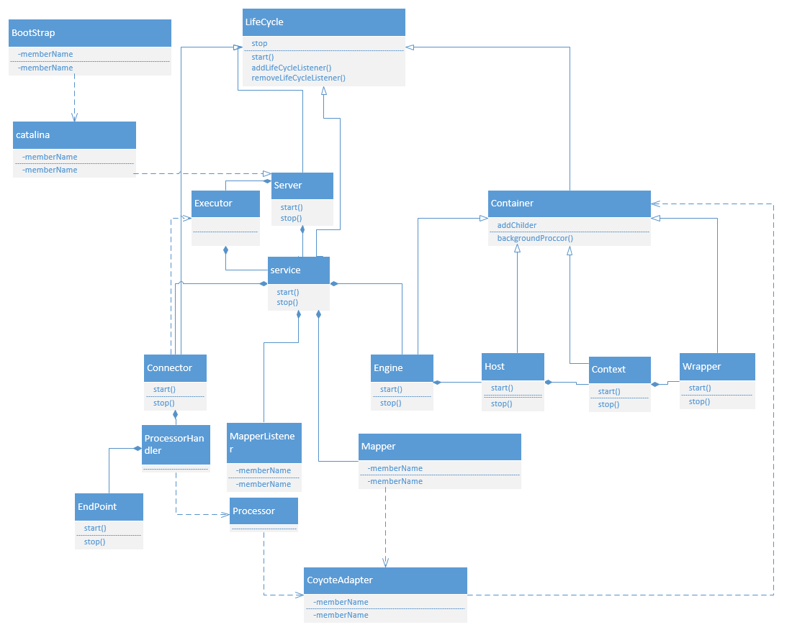

## Tomcat

#### tomcat框架

组合:窗口、按钮、菜单 脱离窗口无法单独存在

聚合:飞机、飞机场 能独立存在

####结构

**server** 组合

-   **Service**

    -   service作用：
        -   接收请求、解析请求、分配给Container
        -   一个server包含多个service
        -   一个service包含多个Connector和一个container
    -   **Connector**
        -   链接器,负责请求的接受和响应
        -   1.监听Socket服务、读取请求消息
        -   2.按照协议解析请求
        -   3.配置先对的容器
        -   4.通过Socket返回响应
    -   **Container**
        -   处理请求

    ​    server中包含多个Connector、container

#### 生命周期

#### tomcat初始化

-   1.Static
    -   ​
-   2.Main
    -   BootStrap实例化、init
        -   初始化BootStrap
        -   init
            -   1.初始化类加载器
            -   实例化Catalina对象 daemon
    -   daemon.load(args) 
        -   加载了catalina的load方法
        -   解析server.xml
        -   初始化server:getServer().init();
    -   daemon.start
    -   ​

#### 请求/处理

